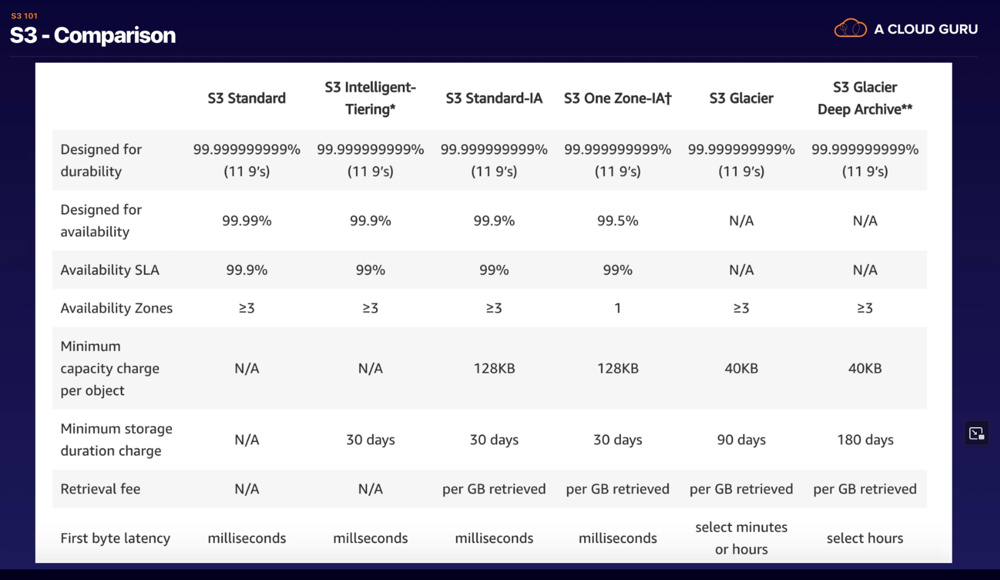
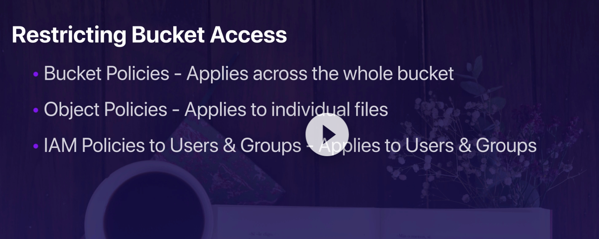

## S3

What is S3?

S3 provides developers and IT teams with secure, durable, highly scalable object storage.
Amazon S3 is easy to use, with a simple web services interface to store and retrieve any amount of data from anywhere on the web

S3 is a safe place to store files.

It is object-based storage

The data is spread across multiple devices and facilities.

Files can be from 0 bytes to 5TB, they are stored in buckets.

All s3 names are unique and have to be as they are globally accessible.

**If you are successfuly uploaded a file, you get back a HTTP 200 access code**

S3 objects are made up of a key, a value, a version ID, Metadata, subresources

## Data Consistency

- Read after write consistency for puts of new objects
- Eventual consistency for overwrite PUTS and DELETES, takes some time to propagate

Guarantees from Amazon

99.9% availabiity for S3

11 9's for S3 information guarantee

## Features

Tiered storage

Lifecycle management

## Storage Classes (exam)

- S3 Standar - 99.9% availability and 99.99999999999% durability. Stored redundantly across multiple devices in multiple facilitys, designed to sustain loss of 2 facilities.
- S3 - IA - Infrequently accessed. For data that is accessed less frequently. But requires rapid access when needed.
- S3 One Zone. For where you want a lower cost option for infrequently accessed data.
- S3 Intelligent Tiering Designed to optimise costs by automatically moving data to thee most cost effective access tier.
- S3 Glacier - Secure, durable low cost storage class for data archiving. Retrieval time is minutes to hours
- S3 Glacier Deep - lowest cost storage class, and retrieval time is 12 hours

## Billed

- Storage, the more you store the more your billed
- Requests
- Storage Management pricing. Different tiers
- Data transfer pricing
- Transfer acceleration
- Cross region replication to another region. DR and high availability

## Exam tips

- Bucket Names share a common name space
- You view them globally but have bucekts in regions
- You can replicate contents of one bucket to another bucket in a different region
- You can change storage classes and encryption

