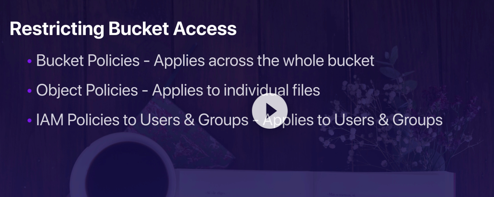
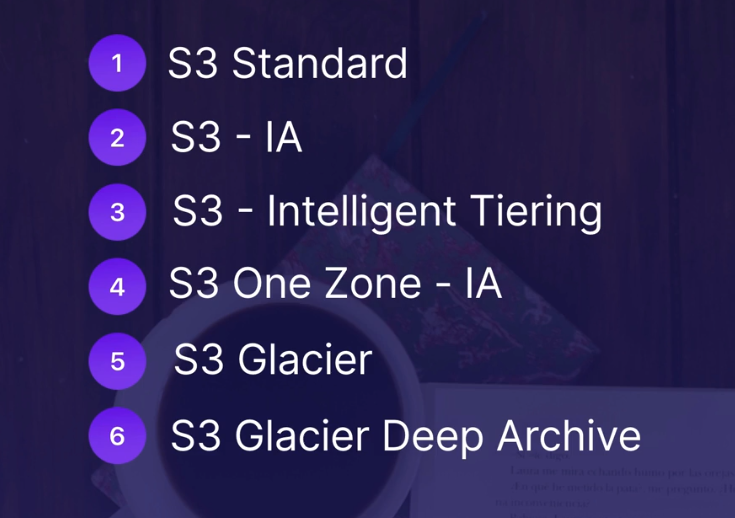

## What makes up the costs o S3

- Storage
- Rquests and data retrieval

## What are the different tiers

## Exam Tips

- What gets the best value out of S3 for what situation?

Just try and avoid S3 Standard, unless you have tons of objects
